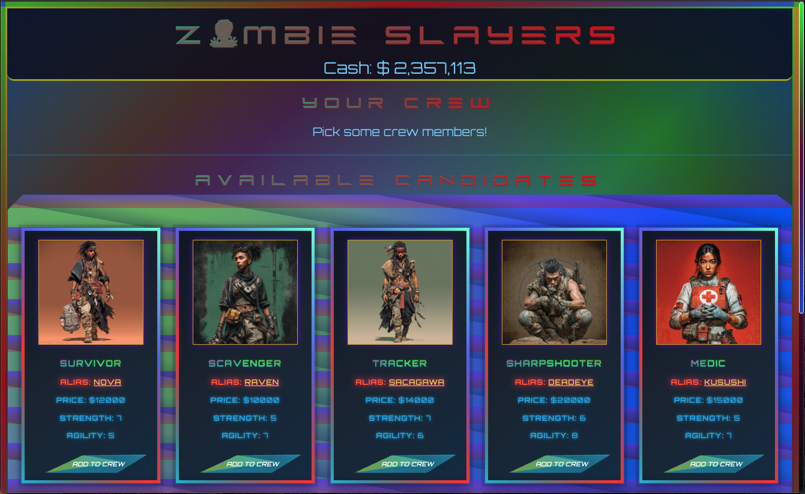
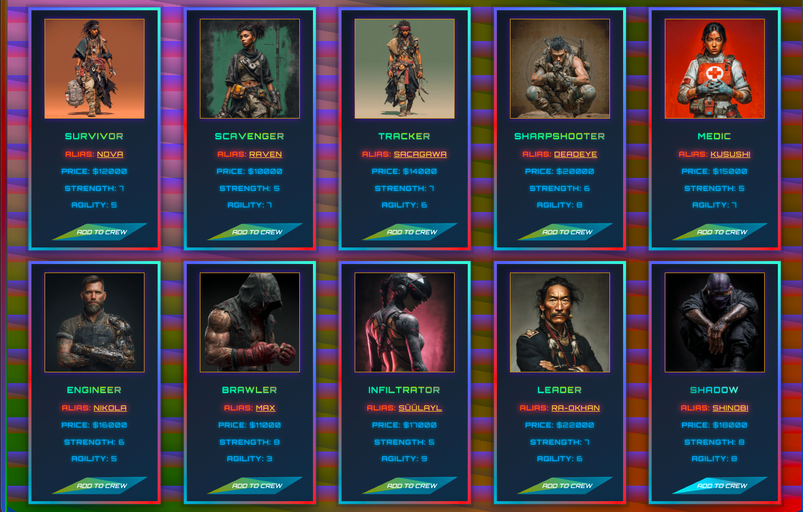
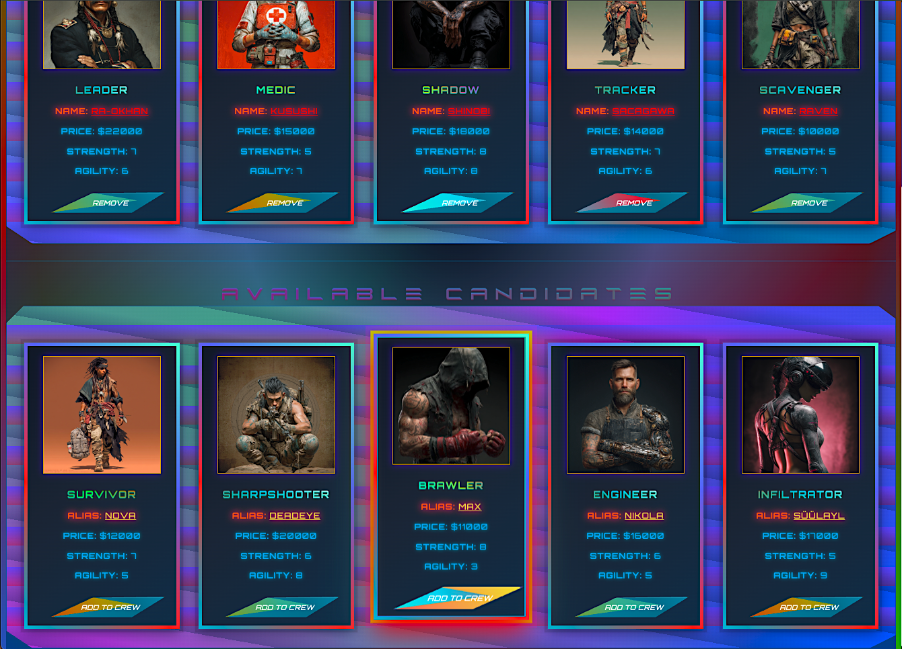
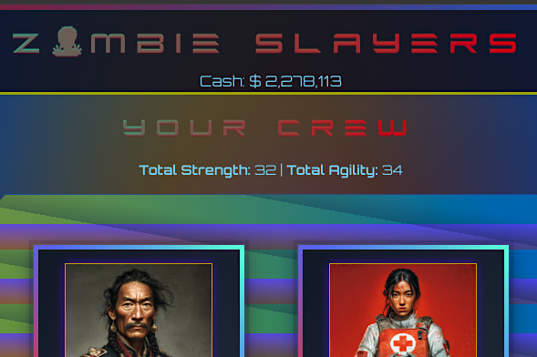
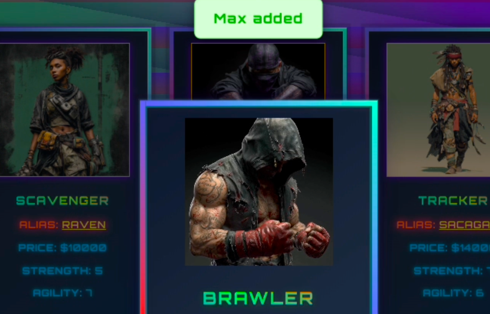
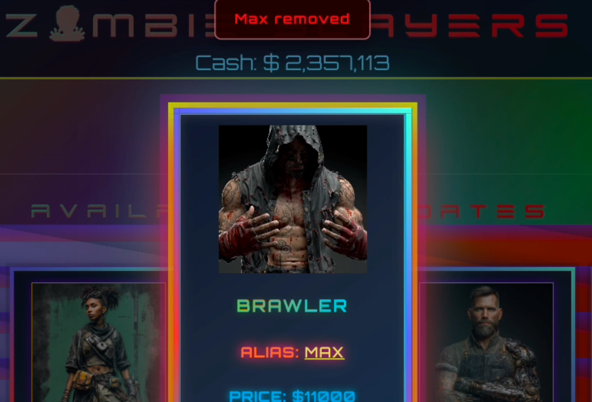
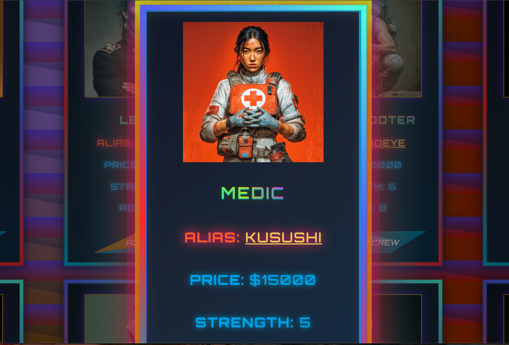
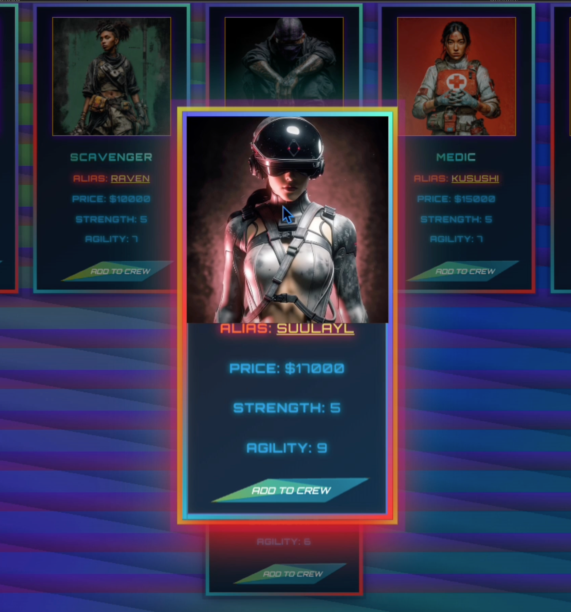
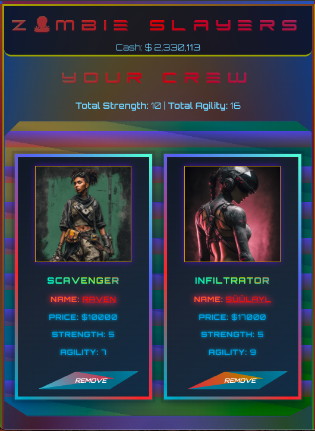
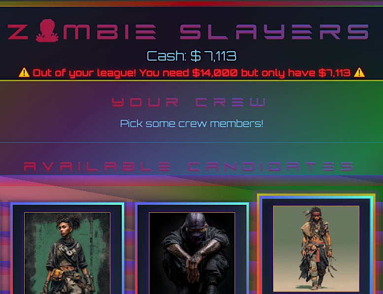

# Zombie Slayers - React State Management Lab

A post-apocalyptic,cyberpunk-themed character recruitment app built with React, featuring dynamic state management, CRUD operations, and interactive UI components.

## 📸 Screenshots

### Main Interface


_Complete interface showing crew management and available candidates_


### Available Candidates


_Grid of all 10 zombie slayers available for recruitment_

### Your Crew Section


_Recruited crew members with total strength and agility stats_

### Crew Member Addition


_Recruited crew members with total strength and agility stats_

### Crew Member removal


_Recruited crew members with total strength and agility stats_

### Interactive Features


_Card zoom effect with video animation and dimmed backdrop_

### Animation


_Card zoom effect with video animation and dimmed backdrop_

### Responsive Features


_Responsive layout_


_Budget validation preventing unauthorized purchases_

## 🚀 Features

### Core Functionality

- **Dynamic Team Building** - Add/remove fighters from your crew
- **Budget Management** - Track spending with real-time cash updates
- **Stat Calculations** - Automatic total strength and agility calculations
- **State Validation** - Prevents adding fighters without sufficient funds

### Enhanced Features

- **Card Zoom Modal** - Click alias names to enlarge cards with backdrop dimming
- **Video Animations** - Special animated videos for Shadow, Sharpshooter, and Brawler characters when zoomed
- **Popup Notifications** - Visual feedback when adding/removing crew members
- **Error Handling** - User-friendly error messages for invalid actions
- **Responsive Design** - Optimized for desktop, tablet, and mobile devices
- **Cyberpunk Styling** - Neon colors, glowing effects, and animated backgrounds

## 🛠️ Technologies Used

- **React 18** - Frontend framework
- **Vite** - Build tool and dev server
- **CSS3** - Custom styling with animations and clip-paths
- **JavaScript ES6+** - Modern syntax with arrow functions, spread operators, destructuring.

## 📦 Installation

```bash
# Clone the repository
git clone [your-repo-url]

# Navigate to project directory
cd zombie-slayers

# Install dependencies
npm install

# Start development server
npm run dev
```

## 🎯 Usage

1. **View Available Candidates** - Browse the roster of 10 unique zombie slayers
2. **Check Stats** - Each fighter displays name, role, price, strength, and agility
3. **Add to Crew** - Click "Add to crew" to recruit (if you have enough cash)
4. **View Crew Stats** - See total strength and agility of your team
5. **Remove Fighters** - Click "Remove" to get a refund and return fighter to candidates
6. **Zoom Cards** - Click on any alias name to see enlarged card with animations

## 📂 Project Structure

```
src/
├── App.jsx
├── App.css
├── appHandlers.js
├── index.css
├── main.jsx
├── assets/
│   ├── images/      # All character .png images
│   ├── videos/      # All character .mp4 videos
│   └── react.svg
├── components/
│   ├── Card/
│   │   ├── Card.jsx
│   │   └── Card.css
│   ├── CrewList/
│   │   ├── CrewList.jsx
│   │   └── CrewList.css
│   ├── CandidatesList/
│   │   ├── CandidatesList.jsx
│   │   └── CandidatesList.css
│   ├── Header/
│   │   ├── Header.jsx
│   │   └── Header.css
│   └── ZoomCardModal/
│       └── ZoomCardModal.jsx
```

## 🧠 Key React Concepts Demonstrated

### State Management

```javascript
const [crew, setCrew] = useState([]);
const [money, setMoney] = useState(2357113);
const [zombieSlayers, setZombieSlayers] = useState(slayers);
```

### Derived State (Non-State Variables)

```javascript
const totalStrength = crew.reduce((sum, slayer) => sum + slayer.strength, 0);
const totalAgility = crew.reduce((sum, slayer) => sum + slayer.agility, 0);
```

### Event Handlers with Validation

```javascript
const handleAddSlayer = (slayer) => {
  if (money < slayer.price) {
    setMessage(`Out of your league!`);
    return;
  }
  setCrew([...crew, slayer]);
  setZombieSlayers(zombieSlayers.filter((s) => s.id !== slayer.id));
  setMoney(money - slayer.price);
};
```

### Conditional Rendering

```javascript
{
  crew.length === 0 ? (
    <p>Pick some crew members!</p>
  ) : (
    <ul>
      {crew.map((slayer) => (
        <Card key={slayer.id} slayer={slayer} />
      ))}
    </ul>
  );
}
```

### Component Composition

```javascript
<Card
  slayer={slayer}
  isCrew={true}
  isZoomed={zoomCard === slayer.id}
  onAliasClick={(e) => handleZoom(e, slayer.id)}
  onButtonClick={() => handleRemoveSlayer(slayer)}
/>
```

## 🎨 Custom Features Beyond Assignment

- **Component Architecture** - Extracted Card component for reusability
- **useRef & useEffect Hooks** - Video playback control for zoomed cards
- **Advanced CSS** - Clip-path polygons, gradient animations, box-shadow layers
- **Modal System** - Backdrop overlay with fixed positioning for zoomed cards
- **Popup Notifications** - Timed success/error messages with smooth transitions

## 🐛 Known Issues

None currently. Please report any bugs in the Issues section.

## 📝 Assignment Requirements Completed

- ✅ State management with useState
- ✅ Add fighters to crew
- ✅ Remove fighters from team
- ✅ Display total strength and agility
- ✅ Budget tracking and validation
- ✅ Conditional rendering for empty/populated states
- ✅ Filter operations to prevent duplicate additions
- ✅ Spread operators for immutable state updates
- ✅ Array methods (map, filter, reduce)

## 🚧 Future Enhancements

- [ ] Persistent state with localStorage
- [ ] Character sorting/filtering options
- [ ] Battle simulation system
- [ ] Achievement/unlockables system
- [ ] Sound effects and background music

## 👤 Author

[Your Name]
GitHub: [@Cordero080](https://github.com/Cordero080)

- LinkedIn: [Your LinkedIn](https://linkedin.com/in/yourprofile)

## 📄 License

This project is licensed under the MIT License - see the LICENSE file for details.

## 🙏 Acknowledgments

- General Assembly for the assignment requirements
- Character designs and initial concept from GA curriculum
- Custom enhancements and styling by [Your Name]

---

**Note:** This project was created as part of a React state management exercise. The focus is on demonstrating core React concepts including state, props, event handlers, and component architecture.
